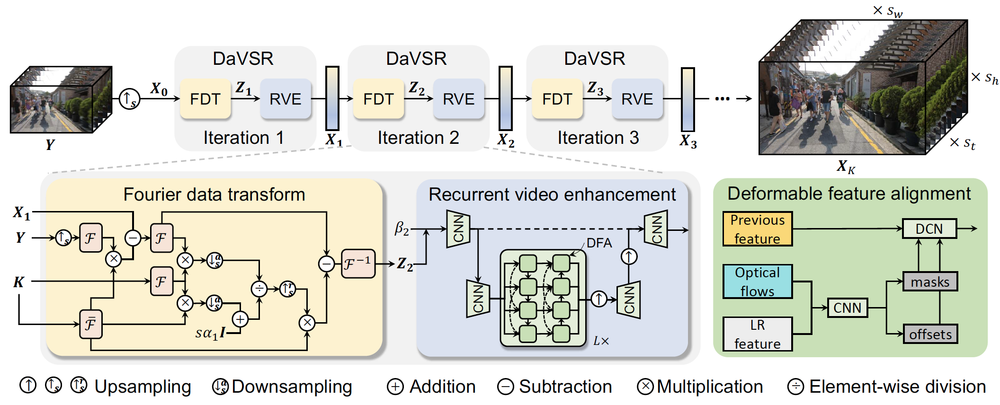
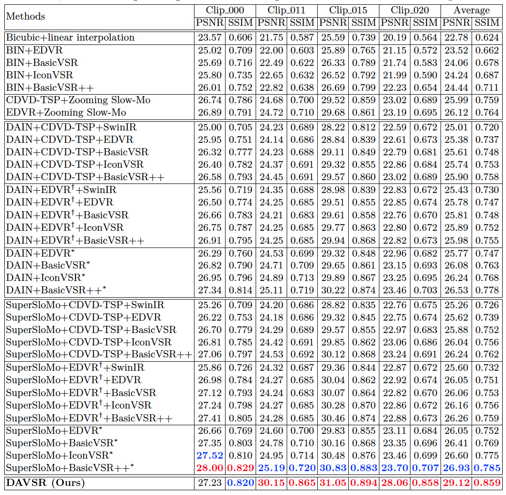
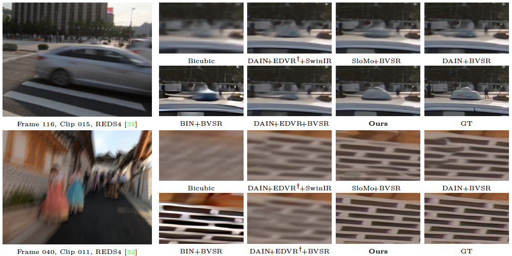

# Towards Interpretable Video Super-Resolution via Alternating Optimization (ECCV 2022)

[Jiezhang Cao](https://www.jiezhangcao.com/), [Jingyun Liang](https://jingyunliang.github.io), [Kai Zhang](https://cszn.github.io/), [Wenguan Wang](https://sites.google.com/view/wenguanwang), [Qin Wang](https://www.qin.ee/), [Yulun Zhang](http://yulunzhang.com/), [Hao Tang](http://disi.unitn.it/~hao.tang/), [Luc Van Gool](https://scholar.google.com/citations?user=TwMib_QAAAAJ&hl=en)

Computer Vision Lab, ETH Zurich.

---

[arxiv](https://arxiv.org/abs/2207.10765)
**|**
[supplementary](https://github.com/caojiezhang/DAVSR/releases)
**|**
[pretrained models](https://github.com/caojiezhang/DAVSR/releases)
**|**
[visual results](https://github.com/caojiezhang/DAVSR/releases)

[](https://arxiv.org/abs/2207.10765)
[](https://github.com/caojiezhang/DAVSR)
[](https://github.com/caojiezhang/DAVSR/releases)


This repository is the official PyTorch implementation of "Towards Interpretable Video Super-Resolution via Alternating Optimization"
([arxiv](https://arxiv.org/abs/2207.10765), [supp](https://github.com/caojiezhang/DAVSR/releases/download/v0.0/supplementary.pdf), [pretrained models](https://github.com/caojiezhang/DAVSR/releases), [visual results](https://github.com/caojiezhang/DAVSR/releases)). DAVSR ahcieves state-of-the-art performance in practical time-space video super-resolution. 

<p align="center">
  <a href="https://github.com/caojiezhang/DAVSR/releases">
    
  </a>
</p>

---

> In this paper, we study a practical space-time video super-resolution (STVSR) problem which aims at generating a high-framerate high-resolution sharp video from a low-framerate low-resolution blurry video. Such problem often occurs when recording a fast dynamic event with a low-framerate and low-resolution camera, and the captured video would suffer from three typical issues: i) motion blur occurs due to object/camera motions during exposure time; ii) motion aliasing is unavoidable when the event temporal frequency exceeds the Nyquist limit of temporal sampling; iii) high-frequency details are lost because of the low spatial sampling rate. These issues can be alleviated by a cascade of three separate sub-tasks, including video deblurring, frame interpolation, and super-resolution, which, however, would fail to capture the spatial and temporal correlations among video sequences. To address this, we propose an interpretable STVSR framework by leveraging both model-based and learning-based methods. Specifically, we formulate STVSR as a joint video deblurring, frame interpolation, and super-resolution problem, and solve it as two sub-problems in an alternate way. For the first sub-problem, we derive an interpretable analytical solution and use it as a Fourier data transform layer. Then, we propose a recurrent video enhancement layer for the second sub-problem to further recover high-frequency details. Extensive experiments demonstrate the superiority of our method in terms of quantitative metrics and visual quality. 
<p align="center">
  
</p>

#### Contents

1. [Requirements](#Requirements)
1. [Quick Testing](#Quick-Testing)
1. [Training](#Training)
1. [Results](#Results)
1. [Citation](#Citation)
1. [License and Acknowledgement](#License-and-Acknowledgement)


## TODO
- [ ] Add pretrained model
- [ ] Add results of test set

## Requirements
> - Python 3.8, PyTorch >= 1.9.1
> - mmedit 0.11.0
> - Requirements: see requirements.txt
> - Platforms: Ubuntu 18.04, cuda-11.1

## Quick Testing
Following commands will download [pretrained models](https://github.com/caojiezhang/DAVSR/releases) and [test datasets](https://github.com/caojiezhang/DAVSR/releases). If out-of-memory, try to reduce `num_frame_testing` and `size_patch_testing` at the expense of slightly decreased performance.


```bash
# download code
git clone https://github.com/caojiezhang/DAVSR
cd DAVSR
pip install -r requirements.txt

python tools/test.py configs/restorers/uvsrnet/002_pretrain_uvsr3DBDnet_REDS_25frames_3iter_sf544_slomo_modify_newdataset.py work_dirs/002_pretrain_uvsr3DBDnet_REDS_25frames_3iter_sf544_slomo_modify_newdataset/latest.pth

```

**All visual results of DAVSR can be downloaded [here](https://github.com/caojiezhang/DAVSR/releases)**.


## Dataset
The training and testing sets are as follows (see the [supplementary](https://github.com/caojiezhang/DAVSR/releases) for a detailed introduction of all datasets). For better I/O speed, use [create_lmdb.py](https://github.com/cszn/KAIR/tree/master/scripts/data_preparation/create_lmdb.py) to convert `.png` datasets to `.lmdb` datasets.

Note: You do **NOT need** to prepare the datasets if you just want to test the model. `main_test_vrt.py` will download the testing set automaticaly.


| Task                                                          |                                                                                                                                                                                                                                    Training Set                                                                                                                                                                                                                                     |                                                                                                                                                                                                                                                                                 Testing Set                                                                                                                                                                                                                                                                                  |        Pretrained Model and Visual Results of DAVSR  |
|:--------------------------------------------------------------|:-----------------------------------------------------------------------------------------------------------------------------------------------------------------------------------------------------------------------------------------------------------------------------------------------------------------------------------------------------------------------------------------------------------------------------------------------------------------------------------:|:----------------------------------------------------------------------------------------------------------------------------------------------------------------------------------------------------------------------------------------------------------------------------------------------------------------------------------------------------------------------------------------------------------------------------------------------------------------------------------------------------------------------------------------------------------------------------:|    :---:      |
| Real video denoising                                      |                                                                                 [REDS sharp](https://seungjunnah.github.io/Datasets/reds.html) (266 videos, 266000 frames: train + val except REDS4)   <br  /><br  /> *Use  [regroup_reds_dataset.py](https://github.com/cszn/KAIR/tree/master/scripts/data_preparation/regroup_reds_dataset.py) to regroup and rename REDS val set                                                                                 |                                                                                                                                                                                                                                                           REDS4 (4 videos, 2000 frames: 000, 011, 015, 020 of REDS)                                                                                                                                                                                                                                                           | [here](https://github.com/caojiezhang/RVDNet/releases) |

## Training

```bash

./tools/dist_train.sh configs/restorers/uvsrnet/002_pretrain_uvsr3DBDnet_REDS_25frames_3iter_sf544_slomo_modify_newdataset.py 8

```

## Results
We achieved state-of-the-art performance on practical space-time video super-resolution. Detailed results can be found in the [paper](https://arxiv.org/abs/2207.10765).

<p align="center">
  
</p>

<p align="center">
  
</p>


## Citation
  @inproceedings{cao2022davsr,
    title={Towards Interpretable Video Super-Resolution via Alternating Optimization},
    author={Cao, Jiezhang and Liang, Jingyun and Zhang, Kai and Wang, Wenguan and Wang, Qin  and Zhang, Yulun and Tang, Hao and Van Gool, Luc},
    booktitle={European conference on computer vision},
    year={2022}
  }


## License and Acknowledgement
This project is released under the MIT license. We refer to codes from [KAIR](https://github.com/cszn/KAIR), [BasicSR](https://github.com/xinntao/BasicSR), and [mmediting](https://github.com/open-mmlab/mmediting). Thanks for their awesome works. The majority of RVDNet is licensed under CC-BY-NC, however portions of the project are available under separate license terms: KAIR is licensed under the MIT License, BasicSR, Video Swin Transformer and mmediting are licensed under the Apache 2.0 license.
